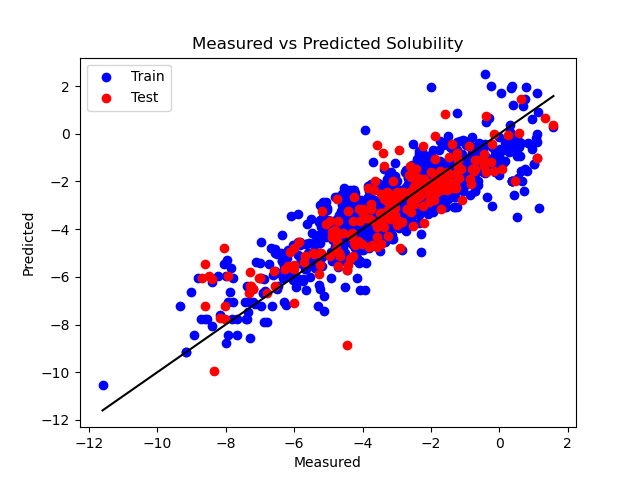

# Predicting the Solubility of Molecules

This project is an end-to-end cheminformatics workflow for predicting the aqueous solubility (LogS) of molecules using molecular descriptors and machine learning. The approach is based on the work of John S. Delaney, leveraging a published dataset and the RDKit cheminformatics toolkit.

## Project Overview
- **Dataset:** Experimental solubility data from Delaney (2004)
- **Descriptors:**
  - LogP (octanol-water partition coefficient)
  - MW (molecular weight)
  - RB (number of rotatable bonds)
  - AP (aromatic proportion)
- **Model:** Linear Regression (scikit-learn)
- **Workflow:**
  1. Data loading and preprocessing
  2. Descriptor calculation using RDKit
  3. Model training and evaluation
  4. Visualization of results

## Requirements
- Python 3.x
- pandas
- numpy
- scikit-learn
- matplotlib
- RDKit

Install requirements with:
```bash
pip install pandas numpy scikit-learn matplotlib rdkit
```

## Usage
Open and run the notebook `mol-sol.ipynb` step by step. The notebook will:
- Load the dataset
- Compute molecular descriptors
- Train a **linear regression** model
- Test other regression models (**Ridge**, **Lasso**, **Elastic Net LR**, and **Gradient Boosting for regression**.)
- Evaluate and visualize the results

## Visualizing results
Plots showing measured vs. predicted solubility for both training and test sets for linear regression and gradient boosting.




## References
- Delaney, J. S. (2004). "ESOL: Estimating Aqueous Solubility Directly from Molecular Structure." *Journal of Chemical Information and Computer Sciences*, 44(3), 1000–1005. [Link](https://pubs.acs.org/doi/10.1021/ci034243x)
- RDKit: Open-source cheminformatics. [http://www.rdkit.org](http://www.rdkit.org)

---

**Author:** Meghna A. Manae
